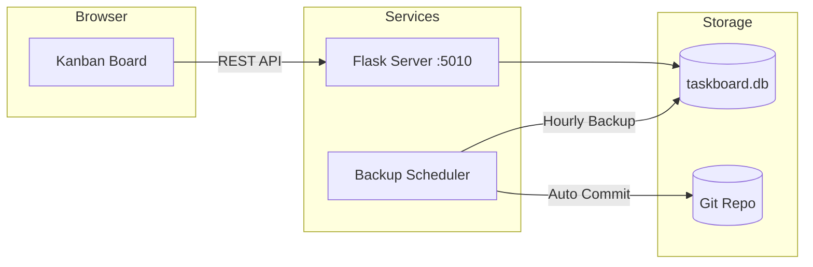

# Task Board

A Flask-based Kanban task management application with drag-and-drop functionality, automatic database backups, and a dark mode UI inspired by Apple documentation aesthetics.

## Tech Stack

- **Backend:** Python 3.12+ with Flask
- **Database:** SQLite with SQLAlchemy 2.0 ORM (modern type hints)
- **Migrations:** Alembic for database schema management
- **Frontend:** Tailwind CSS (CDN), SortableJS for drag-and-drop, Canvas Confetti for celebrations
- **Package Manager:** [uv](https://github.com/astral-sh/uv) for fast dependency management
- **Automation:** Automated hourly database backups via git commits

## Architecture



## Prerequisites

- **Python 3.12+**
- **[uv](https://github.com/astral-sh/uv)** for dependency management
- **Git** for version control and automatic backups (optional)

## Installation

1. Clone the repository:
```bash
git clone https://github.com/mnalavadi/task-manager.git
cd task-manager
```

2. Install dependencies:
```bash
uv sync
```

3. Run database migrations:
```bash
uv run alembic upgrade head
```

## Running

### Development Mode

Start the Flask server:
```bash
uv run python -m src.app
```

Server runs at http://localhost:5010

### With Automatic Backups

Run the database backup scheduler (optional):
```bash
uv run python -m src.scheduler
```

The scheduler will automatically commit and push database changes to git every hour at the top of the hour.

### Deployment

For deployment on Linux with systemd:

```bash
cd install
./install.sh
```

This will:
- Install/update uv
- Install project dependencies
- Set up systemd services for both the web app and backup scheduler
- Configure automatic startup on boot
- Set up Cloudflare Tunnel (if configured)

#### Systemd Services

Two services are installed:

| Service | Purpose | Port |
|---------|---------|------|
| `projects_task-manager.service` | Flask web application | 5010 |
| `projects_task-manager_scheduler.service` | Hourly database backup | N/A |

**Manage services:**
```bash
# Check status
sudo systemctl status projects_task-manager.service
sudo systemctl status projects_task-manager_scheduler.service

# View logs
sudo journalctl -u projects_task-manager.service -f
sudo journalctl -u projects_task-manager_scheduler.service -f

# Restart services
sudo systemctl restart projects_task-manager.service
sudo systemctl restart projects_task-manager_scheduler.service
```

## Project Structure

```
task-manager/
├── src/                       # Source code
│   ├── __init__.py
│   ├── app.py                 # Flask application entry point
│   ├── scheduler.py           # Hourly database backup scheduler
│   ├── config.py              # Configuration constants
│   ├── database_orm.py        # SQLAlchemy 2.0 models
│   ├── datamodels.py          # Data transfer objects
│   └── db.py                  # Database connection utilities
├── alembic/                   # Database migrations
│   ├── env.py                 # Migration environment
│   ├── script.py.mako         # Migration template
│   └── versions/              # Migration files
├── alembic.ini                # Alembic configuration
├── data/                      # Database storage
│   ├── .gitkeep               # Keep directory in git
│   └── taskboard.db           # SQLite database (auto-backed up)
├── templates/                 # Jinja2 templates
│   ├── base.html              # Base template with dark theme
│   ├── index.html             # Main Kanban board
│   └── projects.html          # Projects management
├── static/                    # Static assets
│   ├── css/style.css          # Custom styles
│   ├── js/board.js            # Drag-and-drop & interactions
│   └── kids-cheering.mp3      # Celebration audio
├── tests/                     # Test suite
│   ├── conftest.py            # Test fixtures
│   ├── test_app.py            # Flask app tests (17 tests)
│   ├── test_database_orm.py   # ORM model tests (9 tests)
│   └── test_datamodels.py     # Data model tests
├── install/                   # Deployment to a linux server (raspberry pi)
│   ├── install.sh             # Automated installation script
│   ├── projects_task-manager.service          # Flask app systemd service
│   └── projects_task-manager_scheduler.service # Backup scheduler service
├── pyproject.toml             # Dependencies & tool config
├── TODO.md                    # Development roadmap
└── README.md
```

## API Endpoints

| Endpoint | Method | Description |
|----------|--------|-------------|
| `/` | GET | Main Kanban board view |
| `/projects` | GET | Projects management page |
| `/api/tickets` | POST | Create new ticket |
| `/api/tickets/<id>` | GET | Get ticket details |
| `/api/tickets/<id>` | PUT | Update ticket |
| `/api/tickets/<id>` | DELETE | Delete ticket |
| `/api/tickets/<id>/status` | PATCH | Update ticket status (drag-drop) |
| `/api/projects` | POST | Create new project |
| `/api/projects/<id>` | GET | Get project details |
| `/api/projects/<id>` | PUT | Update project |
| `/api/projects/<id>` | DELETE | Delete project and its tickets |

### POST /api/tickets

```bash
curl -X POST http://localhost:5010/api/tickets \
  -H "Content-Type: application/json" \
  -d '{"title": "Implement feature X", "project_id": 1}'
```

Request body:
```json
{
  "title": "string (required)",
  "project_id": "integer (required)",
  "description": "string (optional)",
  "acceptance_criteria": "string (optional)",
  "scope": "string (optional)",
  "prompt": "string (optional)"
}
```

## Celebration Feature

When a ticket is moved to the "Done" column, the app celebrates your achievement with:
- 🎊 **Confetti Animation:** 3-second confetti burst from multiple points on screen
- 🎉 **Celebration Audio:** Kids cheering sound effect (50% volume, gracefully fails if autoplay blocked)
- 🎨 **Success Toast:** Green-bordered notification with custom styling

This feature creates a satisfying dopamine hit for completing tasks, making the board more engaging and fun to use.

## Data Models

```
Project
├── id: Integer (PK)
├── name: String(100), unique
├── description: Text
├── local_path: String(500) (nullable)
└── last_modified: DateTime (auto-updated)

Ticket
├── id: Integer (PK)
├── title: String(200)
├── description: Text (nullable)
├── project_id: Integer (FK → Project)
├── status: String(50) [proposed, todo, in_progress, done, wont_do]
├── acceptance_criteria: Text (nullable)
├── scope: Text (nullable)
├── prompt: Text (nullable, for AI assistants like Cursor)
├── created_at: DateTime (auto)
└── updated_at: DateTime (auto)
```


## Database Backups

The project includes an automated backup scheduler (`scheduler.py`) that:
- **Checks for changes** every hour at `:00`
- **Auto-commits** database changes to git with timestamped messages
- **Pushes to remote** to ensure off-site backup
- **Logs all activity** with clear emoji indicators (✅ committed, ⏭️ skipped)

The scheduler runs as a separate process and can be deployed as a systemd service for production use.

### Backup Schedule
```python
# Runs at: 00:00, 01:00, 02:00, ... 23:00
schedule.every().hour.at(":00").do(commit_if_changed)
```

### Manual Backup
You can manually trigger a backup by running the commit function:
```bash
uv run python -c "from src.scheduler import commit_if_changed; commit_if_changed()"
```
