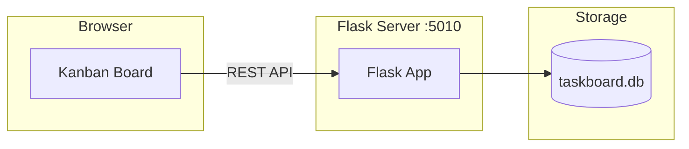

# Task Board

[](https://github.com/momonala/task-manager/actions/workflows/ci.yml)
[](https://codecov.io/gh/momonala/task-manager)

A Flask-based Kanban task management application with drag-and-drop functionality and a dark mode UI inspired by Apple documentation aesthetics.

## Tech Stack

- **Backend:** Python 3.12+ with Flask
- **Database:** SQLite with SQLAlchemy 2.0 ORM (modern type hints)
- **Migrations:** Alembic for database schema management
- **Frontend:** Tailwind CSS (CDN), SortableJS for drag-and-drop, Canvas Confetti for celebrations
- **Package Manager:** [uv](https://github.com/astral-sh/uv) for fast dependency management

`data/taskboard.db` is gitignored and backed up centrally by the `db-backup-services` project, not by this app.

## Architecture



## Prerequisites

- **Python 3.12+**
- **[uv](https://github.com/astral-sh/uv)** for dependency management
- **Git** for version control and automatic backups (optional)

## Installation

1. Clone the repository:
```bash
git clone https://github.com/mnalavadi/task-manager.git
cd task-manager
```

2. Install dependencies:
```bash
uv sync
```

3. Run database migrations:
```bash
uv run alembic upgrade head
```

## Running

### Development Mode

Start the Flask server:
```bash
uv run app
```

Server runs at http://localhost:5010.

### Deployment

For deployment on Linux with systemd:

```bash
cd install
./install.sh
```

This will:
- Install/update uv
- Install project dependencies
- Set up a systemd service for the web app
- Configure automatic startup on boot
- Set up Cloudflare Tunnel (if configured)

#### Systemd Service

| Service | Purpose | Port |
|---------|---------|------|
| `projects_task-manager.service` | Flask web application | 5010 |

**Manage the service:**
```bash
# Check status
sudo systemctl status projects_task-manager.service

# View logs
sudo journalctl -u projects_task-manager.service -f

# Restart
sudo systemctl restart projects_task-manager.service
```

## Project Structure

```
task-manager/
├── src/                       # Source code
│   ├── __init__.py
│   ├── app.py                 # Flask application entry point
│   ├── config.py              # Configuration constants
│   ├── database_orm.py        # SQLAlchemy 2.0 models
│   ├── datamodels.py          # Data transfer objects
│   └── db.py                  # Database connection utilities
├── alembic/                   # Database migrations
│   ├── env.py                 # Migration environment
│   ├── script.py.mako         # Migration template
│   └── versions/              # Migration files
├── alembic.ini                # Alembic configuration
├── data/                      # Database storage (gitignored)
│   └── taskboard.db           # SQLite database, backed up by db-backup-services
├── templates/                 # Jinja2 templates
│   ├── base.html              # Base template with dark theme
│   ├── index.html             # Main Kanban board
│   └── projects.html          # Projects management
├── static/                    # Static assets
│   ├── css/style.css          # Custom styles
│   ├── js/board.js            # Drag-and-drop & interactions
│   └── kids-cheering.mp3      # Celebration audio
├── tests/                     # Test suite
│   ├── conftest.py            # Test fixtures
│   ├── test_app.py            # Flask app tests (17 tests)
│   ├── test_database_orm.py   # ORM model tests (9 tests)
│   └── test_datamodels.py     # Data model tests
├── install/                   # Deployment to a linux server (raspberry pi)
│   ├── install.sh             # Automated installation script
│   └── projects_task-manager.service          # Flask app systemd service
├── pyproject.toml             # Dependencies & tool config
├── TODO.md                    # Development roadmap
└── README.md
```

## API Endpoints

| Endpoint | Method | Description |
|----------|--------|-------------|
| `/` | GET | Main Kanban board view |
| `/projects` | GET | Projects management page |
| `/api/tickets` | POST | Create new ticket |
| `/api/tickets/<id>` | GET | Get ticket details |
| `/api/tickets/<id>` | PUT | Update ticket |
| `/api/tickets/<id>` | DELETE | Delete ticket |
| `/api/tickets/<id>/status` | PATCH | Update ticket status (drag-drop) |
| `/api/tickets/tid/<ticket_id>` | GET | Get ticket by human-readable ID |
| `/api/tickets/tid/<ticket_id>` | PUT | Update ticket title/project/description by human-readable ID |
| `/api/tickets/tid/<ticket_id>` | DELETE | Delete ticket by human-readable ID |
| `/api/projects` | POST | Create new project |
| `/api/projects/<id>` | GET | Get project details |
| `/api/projects/<id>` | PUT | Update project |
| `/api/projects/<id>` | DELETE | Delete project and its tickets |

### POST /api/tickets

```bash
curl -X POST http://localhost:5010/api/tickets \
  -H "Content-Type: application/json" \
  -d '{"title": "Implement feature X", "project_id": 1}'
```

Request body:
```json
{
  "title": "string (required)",
  "project_id": "integer (required)",
  "description": "string (optional)"
}
```

Response includes the auto-generated `ticket_id` (first 8 chars of a UUID):
```json
{"id": 42, "status": "created"}
```

### GET /api/tickets/tid/\<ticket_id\>

Fetch a ticket by its human-readable ID.

```bash
curl http://localhost:5010/api/tickets/tid/a3f9b2c1
```

### PUT /api/tickets/tid/\<ticket_id\>

Update a ticket's title, project, and/or description in a single request. All fields are optional.

```bash
curl -X PUT http://localhost:5010/api/tickets/tid/a3f9b2c1 \
  -H "Content-Type: application/json" \
  -d '{"title": "New title", "project_id": 2, "description": "Updated desc"}'
```

Request body:
```json
{
  "title": "string (optional)",
  "project_id": "integer (optional)",
  "description": "string (optional)"
}
```

### DELETE /api/tickets/tid/\<ticket_id\>

```bash
curl -X DELETE http://localhost:5010/api/tickets/tid/a3f9b2c1
```

## Celebration Feature

When a ticket is moved to the "Done" column, the app celebrates your achievement with:
- 🎊 **Confetti Animation:** 3-second confetti burst from multiple points on screen
- 🎉 **Celebration Audio:** Kids cheering sound effect (50% volume, gracefully fails if autoplay blocked)
- 🎨 **Success Toast:** Green-bordered notification with custom styling

This feature creates a satisfying dopamine hit for completing tasks, making the board more engaging and fun to use.

## Data Models

```
Project
├── id: Integer (PK)
├── name: String(100), unique
├── description: Text
└── last_modified: DateTime (auto-updated)

Ticket
├── id: Integer (PK)
├── ticket_id: String(8), unique (first 8 chars of UUID, auto-generated)
├── title: String(200)
├── description: Text (nullable)
├── project_id: Integer (FK → Project)
├── status: String(50) [proposed, todo, in_progress, done, wont_do]
├── created_at: DateTime (auto)
└── updated_at: DateTime (auto)
```


## Database Backups

`data/taskboard.db` is gitignored and not tracked by this repo. It's backed up centrally by the `db-backup-services` project, which sweeps `*.db` files under `$HOME` on its own schedule.
